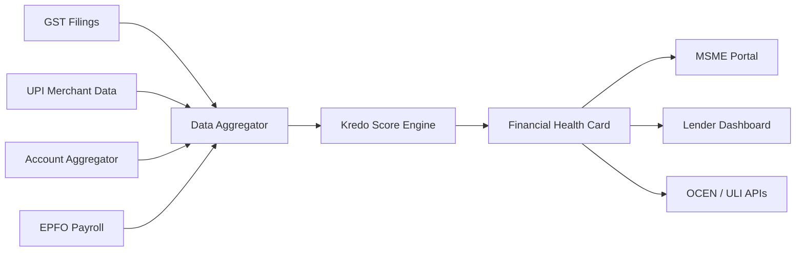

# Kredo — MSME Financial Health Card

**AI-powered alternate data credit intelligence for New-to-Credit (NTC) and New-to-Bank (NTB) MSMEs.**

[](https://kredo-rkbf.onrender.com/)
[](https://hack2skill.com/event/idbinnovate?utm_source=hack2skill&utm_medium=homepage&sectionid=6a25b66b3b5d9099664c1ce2)

> **Submission for IDBI Innovate 2026 — Track 03:** Financial Inclusion · Digital Lending · Credit Decisioning

## Problem

Indian MSMEs — especially NTC/NTB businesses like kirana stores — lack audited financials, collateral, and bureau history. Banks reject viable borrowers; alternate data from GST, UPI, Account Aggregator, and EPFO sits fragmented with no unified scoring framework.

## Solution

**Kredo** generates an AI/ML-driven **MSME Financial Health Card** that:

- Aggregates GST, UPI, AA, and EPFO alternate data
- Computes multidimensional credit scores (300–900)
- Visualizes strengths, risks, and credit capacity
- Integrates with OCEN, ULI, and AA ecosystems (API-ready)
- Enables near real-time credit assessment for lenders

## Live Demo (3 minutes)

1. Open the [live demo](https://kredo-rkbf.onrender.com)
2. Click **Start 3-Min Demo**
3. Follow the guided path: NTC kirana store → Health Card → scoring breakdown → lender approval
4. Or explore freely: switch between **MSME Portal**, **Underwriter View**, and **API Sandbox**

## Architecture



## Scoring Methodology

| Sub-score | Weight (standard) | Weight (micro-merchant) |
|-----------|-------------------|-------------------------|
| GST Compliance | 25% | 30% |
| UPI Flow Stability | 25% | 35% |
| Banking Liquidity | 30% | 35% |
| Payroll Consistency | 20% | N/A (redistributed) |

Total score scaled 300–900 with risk grades A+ through HR.

## Tech Stack

- **Frontend:** React 19, Tailwind CSS v4, Recharts, Motion
- **Backend:** Express, TypeScript, Vite
- **AI:** Google Gemini (underwriting reports, MSME advisor)
- **Data:** Firebase Firestore + local JSON fallback

## Local Setup

```bash
git clone https://github.com/Sarthak702-droid/kredo.git
cd kredo
npm install
cp .env.example .env
# Add GEMINI_API_KEY to .env (optional — core demo works without it)
npm run dev
```

Open http://localhost:3000

## API Endpoints

| Method | Path | Description |
|--------|------|-------------|
| GET | `/api/msmes` | List MSMEs with scores |
| GET | `/api/msmes/:id` | Full health card data |
| POST | `/api/msmes/:id/simulate` | What-if score simulation |
| GET | `/api/applications` | Loan application pipeline |
| POST | `/api/applications/:id/analyze-gemini` | AI underwriting report |

Use the in-app **API Sandbox** (Developer role) for live testing, including ULI Health Card Inquiry.

## License

MIT — built for IDBI Innovate 2026 Track 03 submission.
